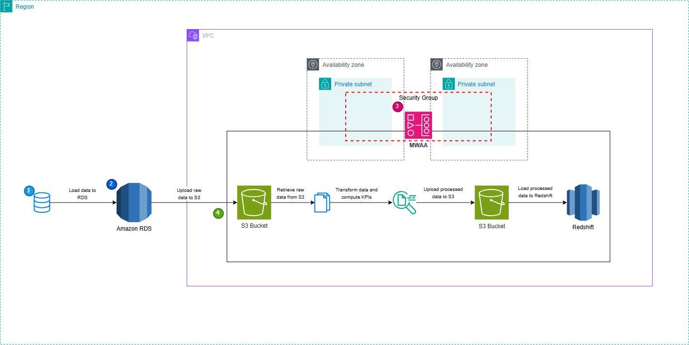

# ETL Pipeline Documentation

## 1. Overview

This document provides a comprehensive guide on the implementation of an ETL pipeline using Apache Airflow. The pipeline successfully extracts data from Amazon S3, transforms it to compute streaming KPIs, validates data integrity, and loads the processed data into Amazon Redshift for further analysis.

## 2. ETL Process Breakdown

### 2.1 Data Extraction

- The pipeline extracts raw data files (`songs.csv`, `users.csv`, `streams.csv`) from an Amazon S3 bucket.
- It uses `S3Hook` in Airflow to efficiently read these CSV files directly into Pandas DataFrames for processing.

### 2.2 Data Transformation & Validation

- The extracted datasets (`streams`, `tracks`, and `users`) are merged based on key identifiers.
- The pipeline computes important KPIs such as:
  - `popularity_index`
  - `most_popular_track`
  - `unique_listeners`
  - `track_diversity_index`
  - `top_artists_per_day`
- Data validation steps include:
  - Ensuring required columns exist before processing.
  - Handling missing values and duplicates.
  - Implementing automated integrity checks to maintain data quality.

### 2.3 Data Loading into Amazon Redshift

- The processed data is loaded into Amazon Redshift using a **staging table** for incremental updates.
- The **Upsert (MERGE) strategy** is used to efficiently update existing records while inserting new ones.
- The `COPY` command is leveraged to load bulk data from S3 into Redshift efficiently.

### 2.4 Logging & Error Handling

- Detailed logging is implemented at every stage of the pipeline to track execution and debug errors.
- Errors encountered during data transformation and ingestion phases are logged and handled gracefully.
- Automatic retries are configured within Airflow to reattempt failed tasks before pipeline failure.

## 3. Deployment in MWAA

- DAGs are deployed to **Amazon Managed Workflows for Apache Airflow (MWAA)**.
- Configuration of **S3 buckets, IAM roles, and security settings** ensures secure and seamless operation.
- Environment variables are used to manage configurations dynamically.

## 4. Conclusion & Next Steps

- The ETL pipeline has been fully implemented, including extraction, transformation, validation, and ingestion into Redshift.
- Performance optimizations, such as data partitioning and indexing strategies, will be explored for further improvements.

## **Architecture Diagram**  
